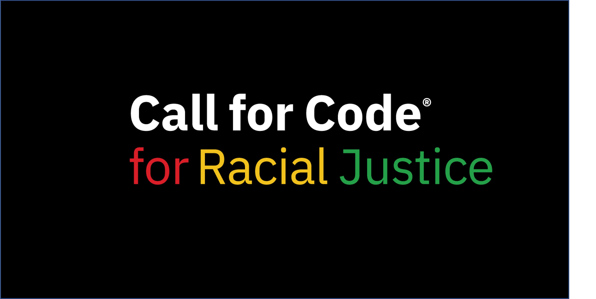

<!-- _coverpage.md -->

<h1 style="">Hacktoberfest: Hacking for Racial Justice</h1>
<h1><b>“To merely condemn expressions and acts of racism is not enough.​ We must go beyond and do more.”</b></h1>

<i>– United Nations Deputy Secretary-General
Amina J. Mohammed</i>

[Get Started](#main)

<!-- background color -->

